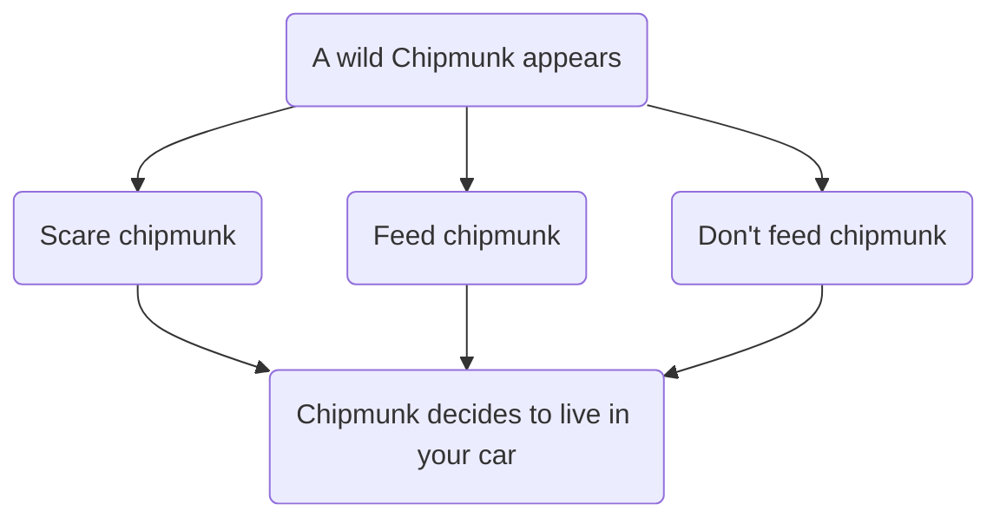

---
output:
  html_document: default
  pdf_document: default
---
# Homework 4: Typora

## Header sizes:

# 1

## 2

### 3

#### 4

##### 5

###### 6

------

### Lists:

- Squirrels
- Love
- Walnuts
- (me too)

1. Ratufa affinis
2. Ratufa bicolor
3. Ratufa indica
4. Ratufa macroura

- [ ] a task list item
- [ ] list syntax required
- [ ] normal **formatting**, @mentions, #1234 refs
- [ ] incomplete
- [x] completed

------


- Petaurista alborufus

------

> "Stop feeding the squirrels" - Dan
>
> > "No" -Mia
> > 

------

### Code:


```
## Area to the left <-- 
pnorm(10, 12, 2)

## Area to the right -->
1-pnorm(10, 12, 2)
```


Do some quick maths: $2+1=3$ and $3*2=6$ Good job.
$$
Quick maths: 2+2=4
$$


| Yes           | No         |
| ------------- | ---------- |
| ==Squirrel==  | Chipmunk   |
| Dog           | Cat        |
| ==Chickadee== | Woodpecker |
| Orca          | Shark      |


